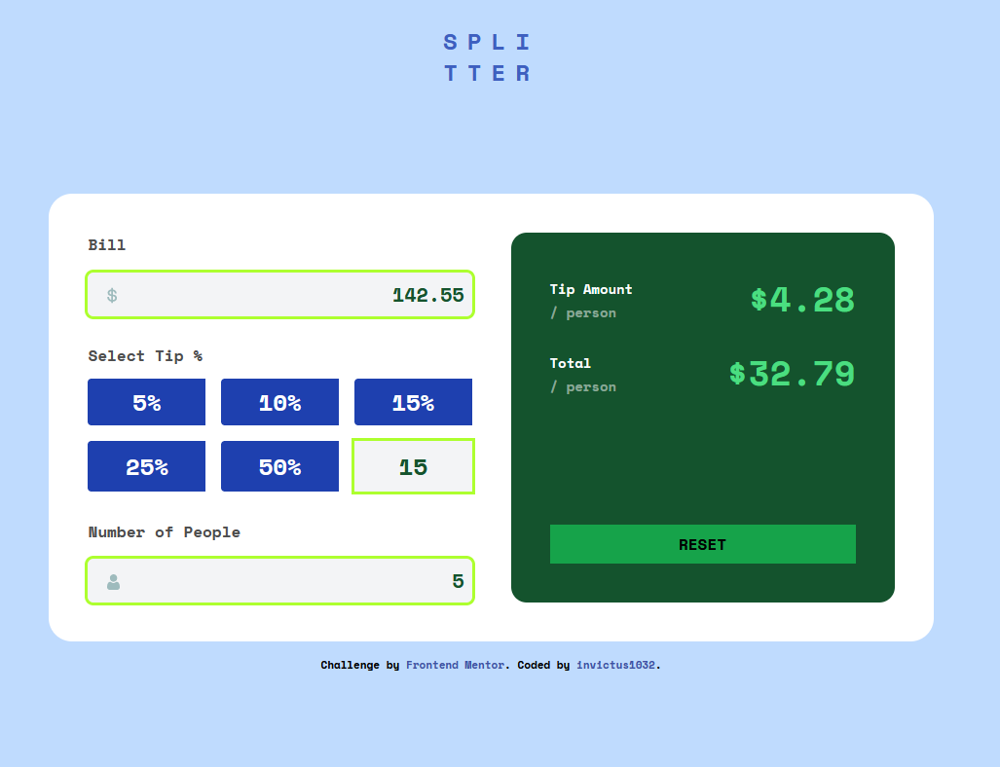
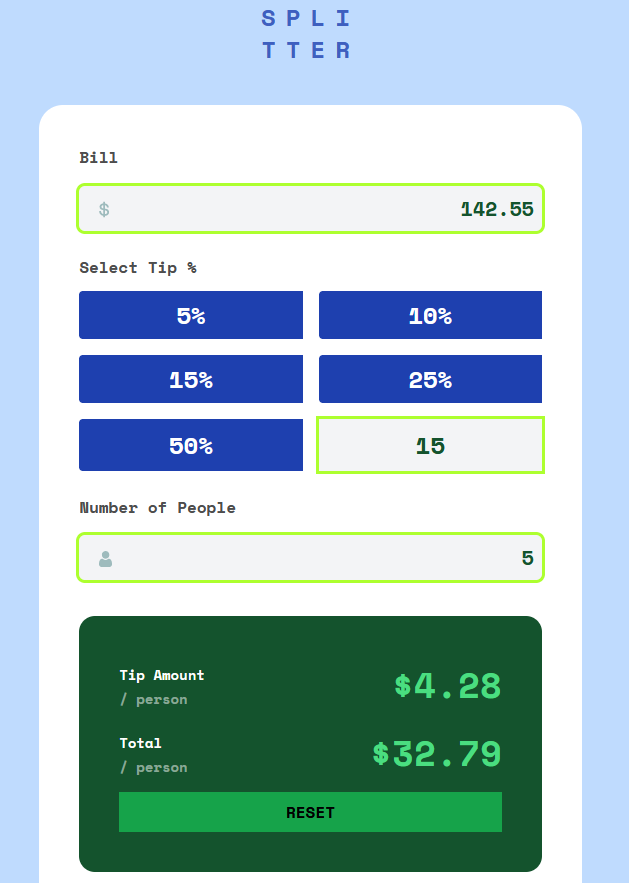

# Frontend Mentor - Tip calculator app solution

This is a solution to the [Tip calculator app challenge on Frontend Mentor](https://www.frontendmentor.io/challenges/tip-calculator-app-ugJNGbJUX). Frontend Mentor challenges help you improve your coding skills by building realistic projects.

## Table of contents

- [Overview](#overview)
  - [The challenge](#the-challenge)
  - [Screenshot](#screenshot)
  - [Links](#links)
- [My process](#my-process)
  - [Built with](#built-with)
  - [What I learned](#what-i-learned)
  - [Continued development](#continued-development)
  - [Useful resources](#useful-resources)
- [Author](#author)

**Note: Delete this note and update the table of contents based on what sections you keep.**

## Overview

### The challenge

Users should be able to:

- View the optimal layout for the app depending on their device's screen size
- See hover states for all interactive elements on the page
- Calculate the correct tip and total cost of the bill per person

### Screenshot

#### Desktop

#### Mobile

### Links

- Solution URL: [Frontend Mentor](https://www.frontendmentor.io/solutions/responsive-tip-calculator-with-tailwindcss-and-typescript-vz5nNM4gJQ)
- Live Site URL: [Netlify](https://fem-invictus1032-4.netlify.app/)

## My process

### Built with

- Semantic HTML5 markup
- CSS Flexbox
- CSS Grid
- Mobile-first workflow
- [Tailwind](https://tailwindcss.com/) - CSS library
- [TypeScript](https://www.typescriptlang.org/) - TypeScript

### What I learned

#### Layout

This project is the hardest I've built so far. It's much more complicated than it looks. Surprisingly, the tip calculation part isn't the hardest, it's the layout (CSS). In the end, I learned that I shouldn't have been fixed on a single layout tool. 

I was stuck for hours trying to figure out how to make my flexbox work as intended. The tip boxes just kept taking the whole screen. And the flex-wrap is hard to control when you want to manipulate both the vertical and horizontal axis. Then I realized, that's why Grid was invented. 

#### Mobile First Workflow

This is my first time actually trying to design the layout exactly from mobile. Usually I still throw in a bunch of CSS rules that apply to desktop while I'm still working on the mobile layout. To be honest, it feels much better. It's easier to start because you start simple. It's also easy to layout because the initial layout is simple. And then It'll get progressively complex as you support bigger devices into your code. 

It's easier than starting right from the most complex layout.

#### Divide Task

From this project, I've learned that it's easier to divide the problem into multiple parts instead of working all of thema t once. For example, I can work on the HTML first, then the CSS, then JS. In CSS, I can further divide it into Layout, Font, Color, Active State, etc. With git branching, this is even a lot easier to do. I can go around messing things up without affecting the master branch. 

### Continued development

In future projects, I'll try to use CSS Grid more often because sometimes it's far more appropiate than Flexbox. 

**Note: Delete this note and the content within this section and replace with your own plans for continued development.**

### Useful resources

- [Tailwind Breakpoints](https://tailwindcss.com/docs/responsive-design) - Kept referencing to this page because I don't fully remember the breakpoints.
- [Tailwind Cheatsheet](https://tailwindcomponents.com/cheatsheet/) - Sometimes my tailwind intellisense doesn't show up, so this cheatsheet helps a lot. 
- [Stackoverflow](https://stackoverflow.com/) - No explanation needed :)

## Author

- Frontend Mentor - [@invictus1032](https://www.frontendmentor.io/profile/invictus1032)
